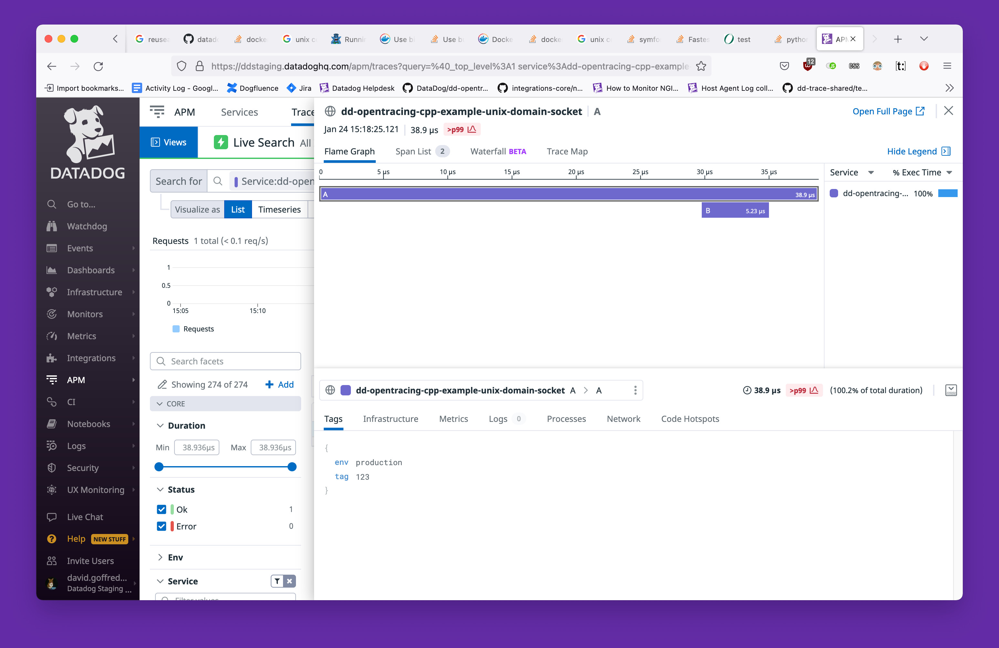

Unix Domain Sockets
===================
This example demonstrates how to configure a C++ tracer and the Datadog agent
to connect to each other over a Unix domain socket.

The tracer accepts an environment variable, `DD_TRACE_AGENT_URL`, whose value
may be the file path to a Unix domain socket.  The tracer will connect to the
agent using the socket rather than over the network.

The Datadog agent accepts an environment variable, `DD_APM_RECEIVER_SOCKET`,
that is analogous to `DD_TRACE_AGENT_URL`, but on the listening end.  See the
[relevant public documentation][1].

This example uses `docker-compose` to start up a Datadog agent and a minimal
C++ tracer that will connect to each other using a Unix domain socket that the
agent will create in the local `datadog-sockets/` directory.

See [docker-compose.yaml](docker-compose.yaml) for how the environment
variables and directory bindings are configured.

[bin/run](bin/run) runs the example.  The environment variable `DD_API_KEY`
must be set to a valid Datadog API key, e.g.
```shell
$ DD_API_KEY=$(cat ~/.dd-keys/default/api-key) bin/run
Building dd-opentracing-cpp-example-unix-domain-socket
Sending build context to Docker daemon  10.75kB
...
```



[1]: https://docs.datadoghq.com/agent/docker/apm/?tab=linux#docker-apm-agent-environment-variables
